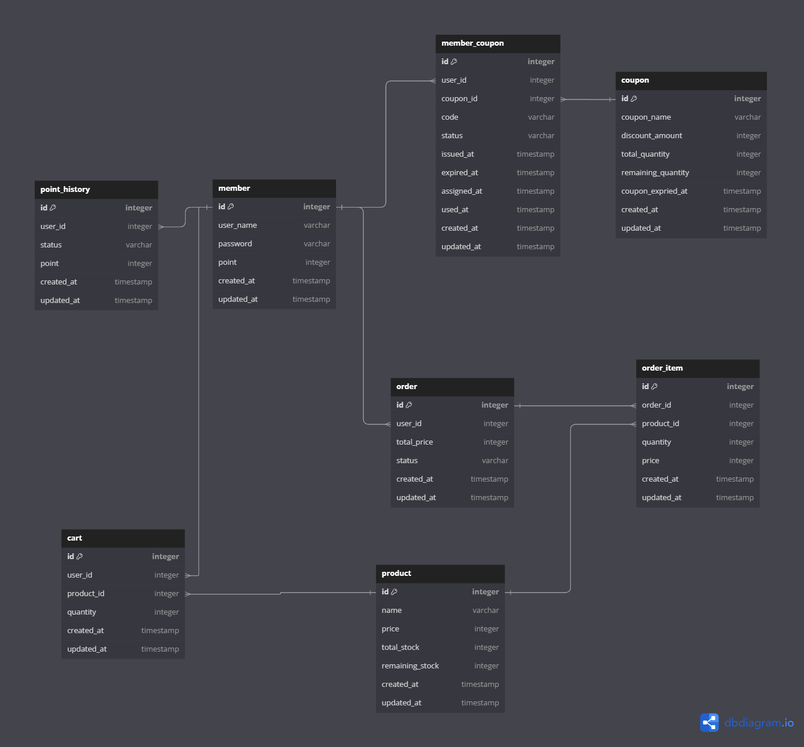

# 데이터베이스 ERD 문서

## 테이블 설명

### 1. **member** (회원 정보 테이블)
| 컬럼 이름      | 데이터 타입 | 설명             |
|----------------|-------------|------------------|
| id             | integer     | 회원 고유 ID (Primary Key) |
| user_name      | varchar     | 회원 이름        |
| password       | varchar     | 회원 비밀번호    |
| point          | integer     | 회원 보유 포인트 |
| created_at     | timestamp   | 생성 시간        |
| updated_at     | timestamp   | 수정 시간        |

**연관관계**: `point_history.user_id`, `order.user_id`, `member_coupon.user_id` 참조

---

### 2. **point_history** (포인트 내역 테이블)
| 컬럼 이름      | 데이터 타입 | 설명             |
|----------------|-------------|------------------|
| id             | integer     | 포인트 내역 ID (Primary Key) |
| user_id        | integer     | 회원 ID (참조: `member.id`) |
| status         | varchar     | 포인트 상태 (e.g., 적립, 사용) |
| point          | integer     | 포인트 변경량    |
| created_at     | timestamp   | 생성 시간        |
| updated_at     | timestamp   | 수정 시간        |

**연관관계**: `member.id` 참조

---

### 3. **order** (주문 테이블)
| 컬럼 이름      | 데이터 타입 | 설명             |
|----------------|-------------|------------------|
| id             | integer     | 주문 ID (Primary Key) |
| user_id        | integer     | 회원 ID (참조: `member.id`) |
| total_price    | integer     | 총 주문 금액     |
| status         | varchar     | 주문 상태        |
| created_at     | timestamp   | 생성 시간        |
| updated_at     | timestamp   | 수정 시간        |

**연관관계**: `member.id` 참조, `order_item.order_id` 참조

---

### 4. **member_coupon** (회원 쿠폰 테이블)
| 컬럼 이름      | 데이터 타입 | 설명             |
|----------------|-------------|------------------|
| id             | integer     | 회원 쿠폰 ID (Primary Key) |
| user_id        | integer     | 회원 ID (참조: `member.id`) |
| coupon_id      | integer     | 쿠폰 ID (참조: `coupon.id`) |
| code           | varchar     | 쿠폰 코드        |
| status         | varchar     | 쿠폰 상태 (e.g., 발급됨, 사용됨) |
| issued_at      | timestamp   | 발급 시간        |
| expired_at     | timestamp   | 만료 시간        |
| assigned_at    | timestamp   | 할당 시간        |
| used_at        | timestamp   | 사용 시간        |
| created_at     | timestamp   | 생성 시간        |
| updated_at     | timestamp   | 수정 시간        |

**연관관계**: `member.id`, `coupon.id` 참조

---

### 5. **coupon** (쿠폰 테이블)
| 컬럼 이름      | 데이터 타입 | 설명             |
|----------------|-------------|------------------|
| id             | integer     | 쿠폰 ID (Primary Key) |
| coupon_name    | varchar     | 쿠폰 이름        |
| discount_amount| integer     | 할인 금액        |
| total_quantity | integer     | 쿠폰 총 발급 수량 |
| remaining_quantity | integer | 남은 수량        |
| coupon_expried_at | timestamp | 쿠폰 만료 시간   |
| created_at     | timestamp   | 생성 시간        |
| updated_at     | timestamp   | 수정 시간        |

**연관관계**: `member_coupon.coupon_id` 참조

---

### 6. **product** (상품 테이블)
| 컬럼 이름      | 데이터 타입 | 설명             |
|----------------|-------------|------------------|
| id             | integer     | 상품 ID (Primary Key) |
| name           | varchar     | 상품 이름        |
| price          | integer     | 상품 가격        |
| total_stock    | integer     | 총 재고          |
| remaining_stock| integer     | 남은 재고        |
| created_at     | timestamp   | 생성 시간        |
| updated_at     | timestamp   | 수정 시간        |

**연관관계**: `order_item.product_id`, `cart.product_id` 참조

---

### 7. **order_item** (주문 아이템 테이블)
| 컬럼 이름      | 데이터 타입 | 설명             |
|----------------|-------------|------------------|
| id             | integer     | 주문 아이템 ID (Primary Key) |
| order_id       | integer     | 주문 ID (참조: `order.id`) |
| product_id     | integer     | 상품 ID (참조: `product.id`) |
| quantity       | integer     | 주문한 상품 수량 |
| price          | integer     | 상품 가격        |
| created_at     | timestamp   | 생성 시간        |
| updated_at     | timestamp   | 수정 시간        |

**연관관계**: `order.id`, `product.id` 참조

---

### 8. **cart** (장바구니 테이블)
| 컬럼 이름      | 데이터 타입 | 설명             |
|----------------|-------------|------------------|
| id             | integer     | 장바구니 ID (Primary Key) |
| user_id        | integer     | 회원 ID (참조: `member.id`) |
| product_id     | integer     | 상품 ID (참조: `product.id`) |
| quantity       | integer     | 장바구니에 담긴 상품 수량 |
| created_at     | timestamp   | 생성 시간        |
| updated_at     | timestamp   | 수정 시간        |

**연관관계**: `member.id`, `product.id` 참조

