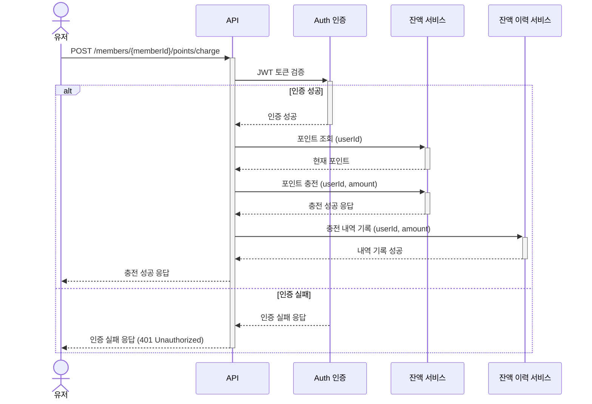
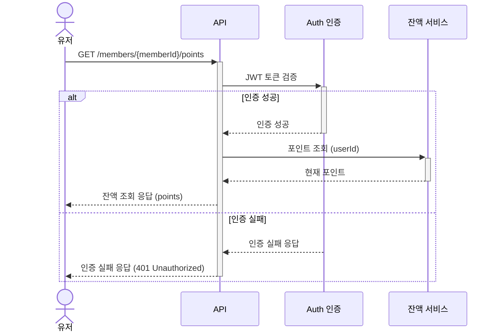
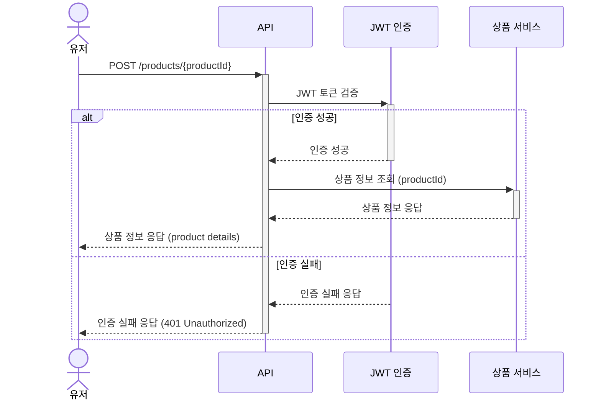
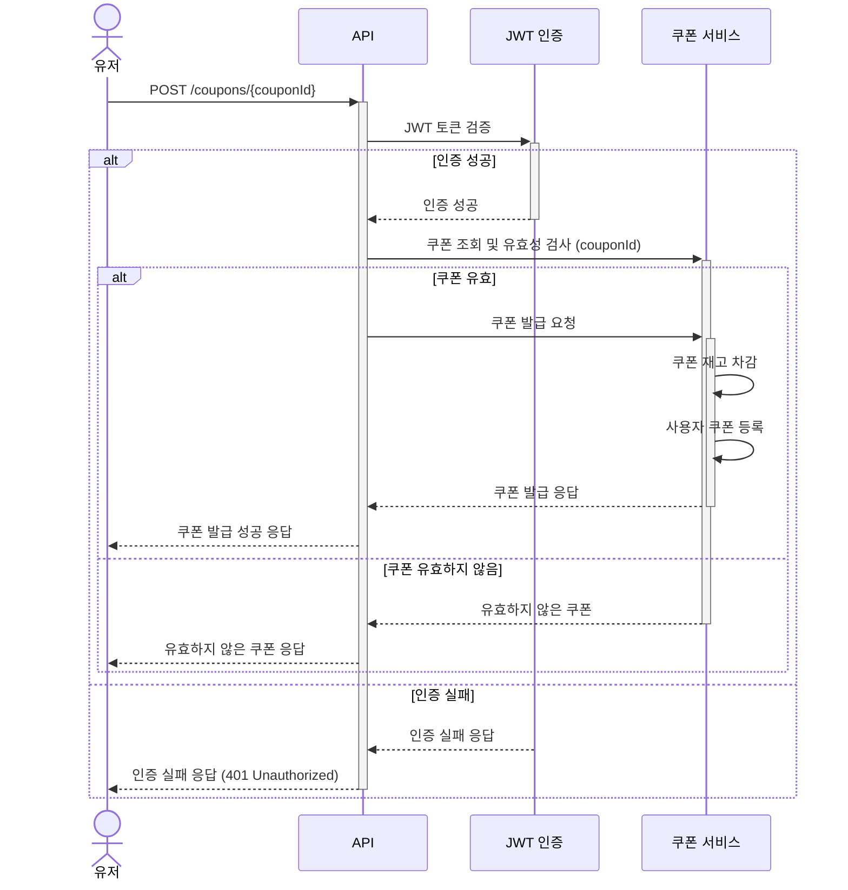
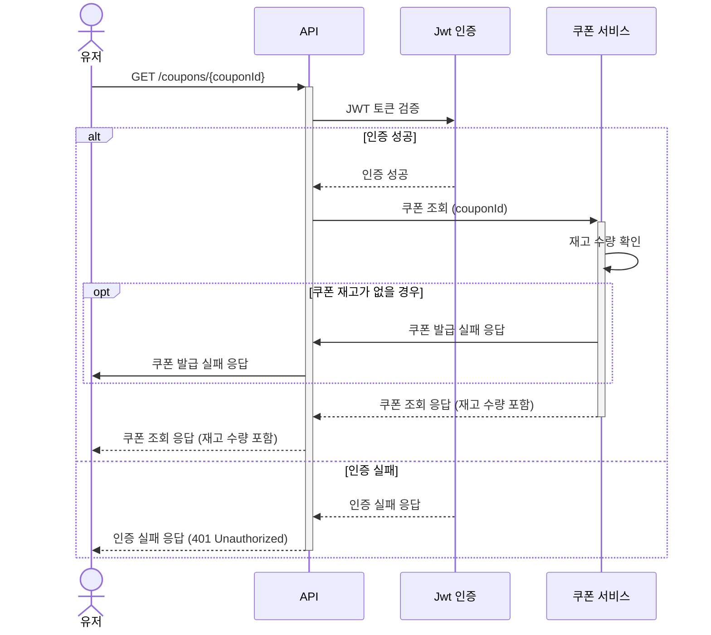
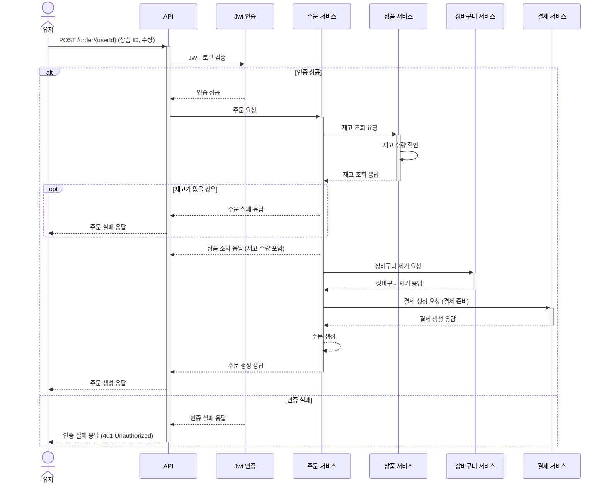
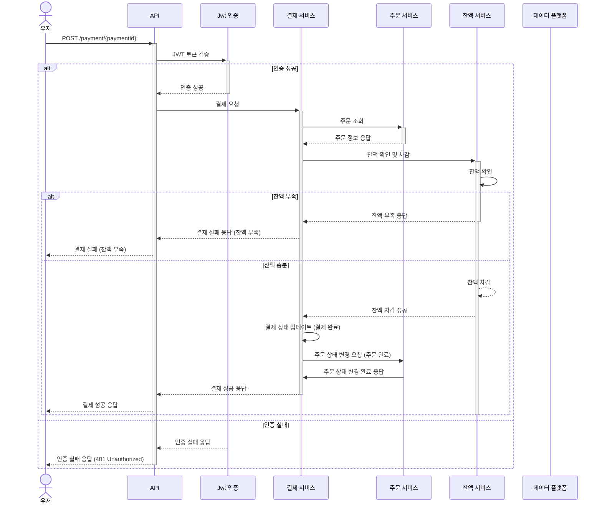
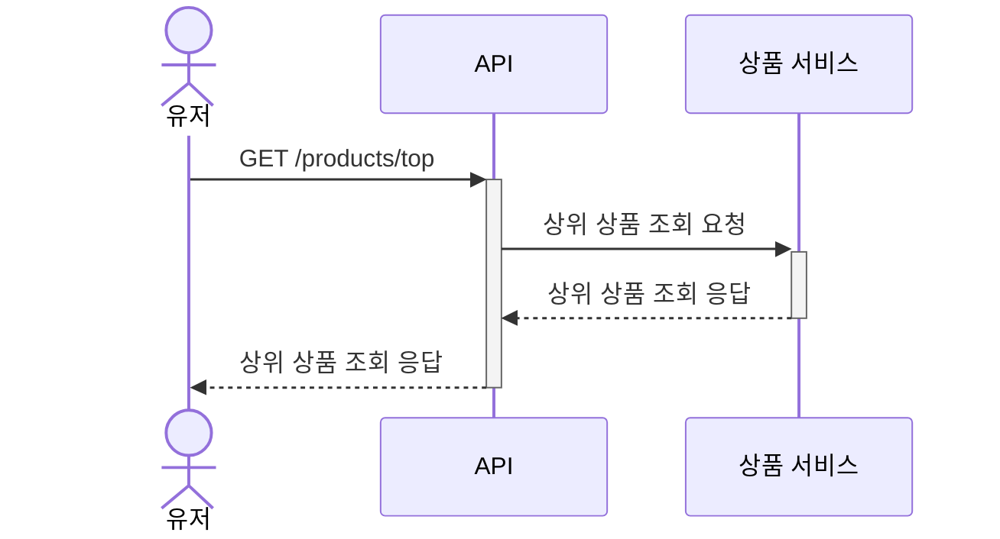

# 시퀀스 다이어그램

---

## 잔액 충전 / 조회 API
- 결제에 사용될 금액을 충전하는 API를 작성합니다.
- 사용자 식별자와 충전할 금액을 받아 잔액을 충전합니다.
- 사용자 식별자를 통해 해당 사용자의 잔액을 조회합니다.

### 잔액 충전

### 잔액 조회

---

## 기존 상품 조회 API
- 상품 정보(ID, 이름, 가격, 잔여수량)를 조회하는 API를 작성합니다.
- 조회 시점의 상품별 잔여 수량이 정확해야 합니다. 
 

---

## 주요 선착순 쿠폰 발급 / 조회 API
- 선착순 쿠폰 발급 API 및 보유 쿠폰 목록 조회 API를 작성합니다.
- 사용자는 선착순으로 할인 쿠폰을 발급받을 수 있습니다.
- 주문 시 유효한 할인 쿠폰을 제출하면 전체 주문 금액에 대해 할인 혜택을 받을 수 있습니다.

### 선착순 쿠폰 발급

### 선착순 쿠폰 조회

---

## 주요 주문 / 결제 API
- 사용자 식별자와 (상품 ID, 수량) 목록을 입력받아 주문하고 결제를 수행하는 API를 작성합니다.
- 결제는 충전된 잔액을 기반으로 수행하며, 성공 시 잔액을 차감합니다.
- 데이터 분석을 위해 결제 성공 시 실시간으로 주문 정보를 데이터 플랫폼에 전송해야 합니다.
    - 데이터 플랫폼은 어플리케이션 외부에 존재하며, Mock API나 Fake Module 등으로 구현 가능합니다.

### 주문 API

### 결제 API

---

## 상위 상품 조회 API

